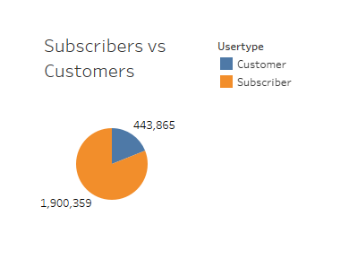
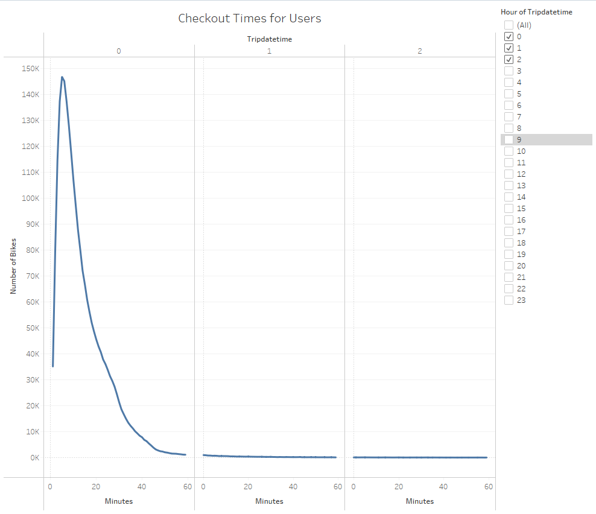
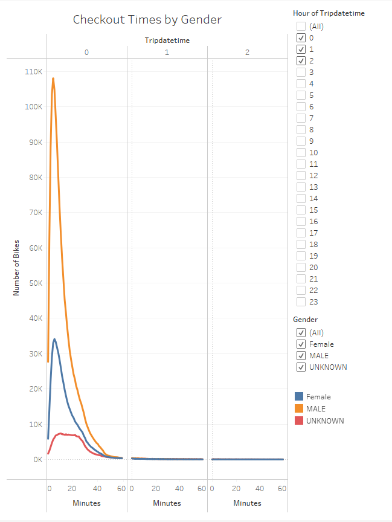
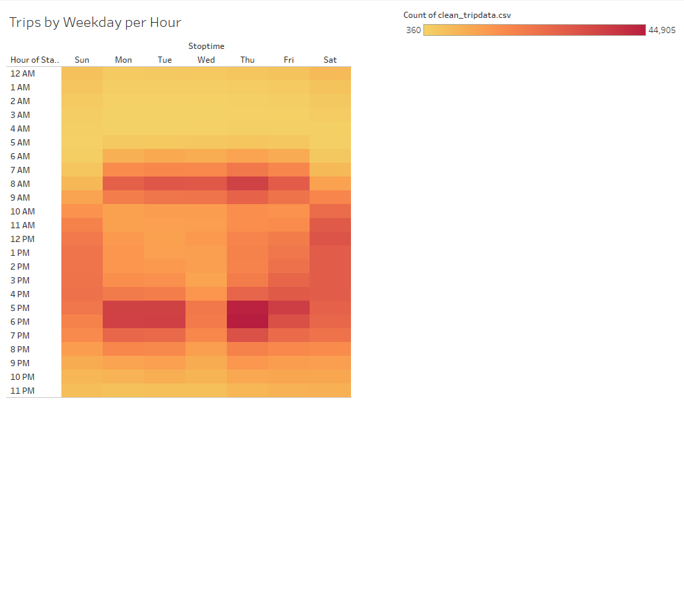
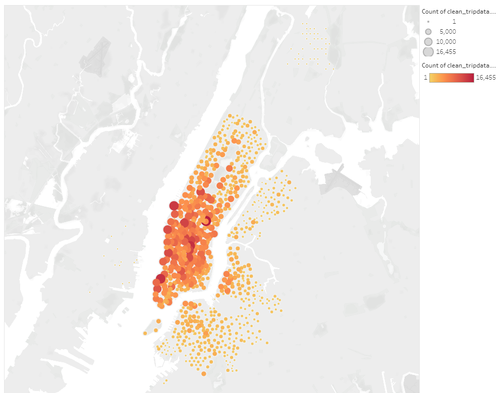

# Bike Sharing Analysis
## Overview 
The purpose of this analysis is to visualize the NYC Citi Bike data to determine if and how a similiar business model in Des Moines Iowa is feasable. 

** Resources and Tools Used:**
* [CitiBike Trip Data](https://s3.amazonaws.com/tripdata/index.html)
* [Tableau Story of Bike Sharing](https://public.tableau.com/profile/gordon.p.thompson#!/vizhome/bikesharingchallenge/StoryofBikeSharing?publish=yes)
* Python, Tableau, Jupyter Notebook

## Results 

This pie chart shows the total number of rides in the month of August and breaks them down into Subscribers vs customers. 80% of the total rides are by subscribers that use bikes on a regular basis. 80% is a high percentage and suggests that bikes are very popular in NYC. 

The average ride for the majority of our users is 15 minutes. This means that bikes can be turned over atleast 3x per hour. 

This visualization shows that a high percentage of our riders are male. This will help the company keep a majority of bikes fitted and geared towards men. 

.PNG)

This heat map shows that the patterns of men and women are roughly the same for times of the week but men rent more frequently. 

The heat map above shows a pattern of busy weekday times being 6am-8am and 5pm-7pm, with the busiest days being Monday and Thursday. This data suggests our users are commuting to and from work.  

Above shows that the majority of subscribers are men and that weekdays are the most popular days. 

Our last visualization shows the most popular places to end a ride and leave a bike. This will help our recovery and maintanence crews plan for the best pickup routes. 

## Summary 

This analysis concludes that Citi Bike sharing is certainly popular and profitable in the city of New York. New York clearly has a large subscriber base routinely commuting to and from work on the weekdays. Future analysis would need to focus on the Des Moines Iowa. Does this potential area have enough workers interested in commute to work on a bike? Do enough of these workers live within reasonable travel distance to their jobs? Can biking be as convenient here as it is in NYC? The next step is to gather data and create visualizations to answer these questions.  

